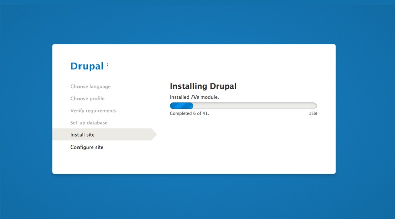

1. Extract the files from **INSTALLATION/em-drupal.zip** to your webroot directory or to your local development environment. The package contains Drupal core code-base, all required modules and the theme.

2. Open the URL to your site in a web browser to start the installer. You will be automatically redirected to the installer page.

3. Choose a language

4. Choose "**Use existing configuration**" and click “**Save and Continue**”.

5. Wait for EM to be installed.

#### Install the demo content

If you'd like to start with a demo content, enable the **EM Demo** module:

1. Open your site in a web browser
2. Click on **Extend** under Administration menu. (`/admin/modules`)
3. Enable the **EM Demo** module.
