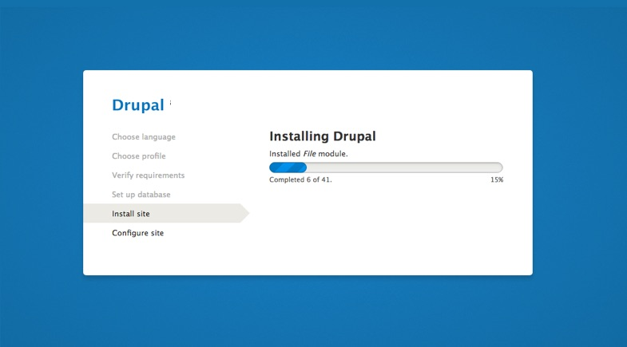
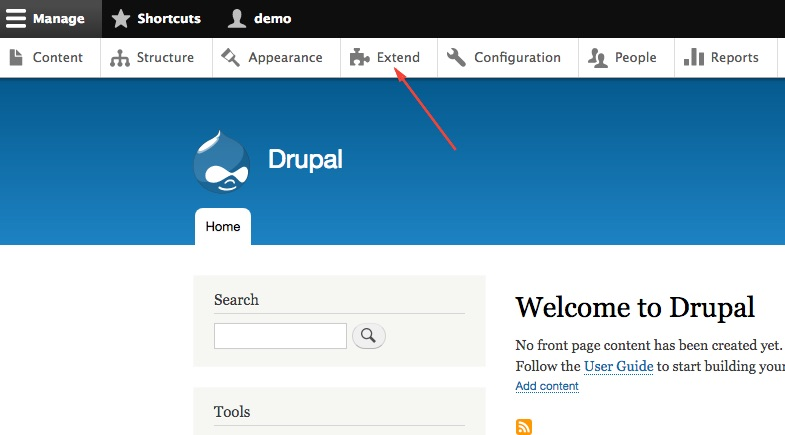
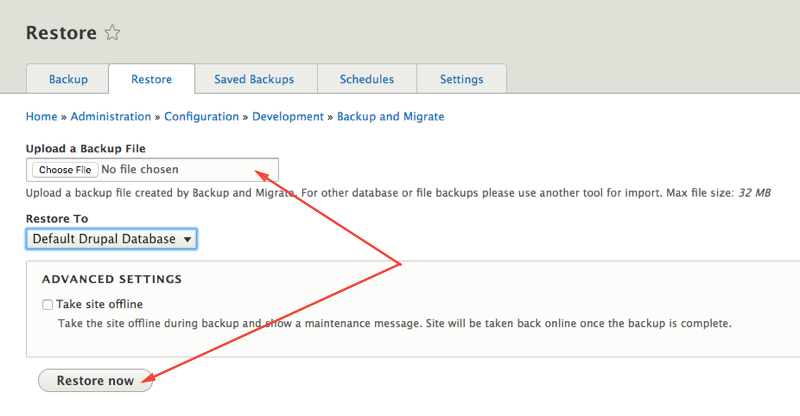

1. Move the content from the **em_drupal** directory to your web root location or to your development environment. Make sure that you copied all the files including hidden files like **.htaccess**
2. Run the installer. Visit your site in a web browser and you will be redirected to the installer page at **/core/install.php**
3. Leave the language to English. If you plan to run the site on other language, you'll chaange the language later.

4. Choose **Standard** installation profile and click on “**Save and Continue**”.

5. Wait for Drupal to be installed.
 
 

 
###  Restoring EM database

After installing Drupal, to get all the EM features, you have to restore the database.

1.  Click on **Extend** under administration toolbar (`/admin/modules`).

2. Enable **Backup and Migrate** and **Admin Toolbar** modules.

3. Under Administration Toolbar, go to **Configuration > Development > Backup and Migrate**. (`/admin/config/development/backup_migrate`)

4. Click on the **Restore** tab, choose the "**em.mysql.gz**" located in the configuration directory in the Envato package and click on **Restore now** button.

!!! This method will override your access data. Now you can Log in to your Drupal site with - user: **demo** pass: **demo**. It is highly recommended to change your user name and password right after restoring the database.

! **Notes for Windows users** When you are using this installation method on a local development environment, in some cases after restoring the database you might see that the styles are not loaded correctly. This is because Drupal **Temporally directory** is set to **/tmp**. To fix this, go to **Configuration  > Media > File system** (`/admin/config/media/file-system`) and change the **Temporally directory** location according your environment.