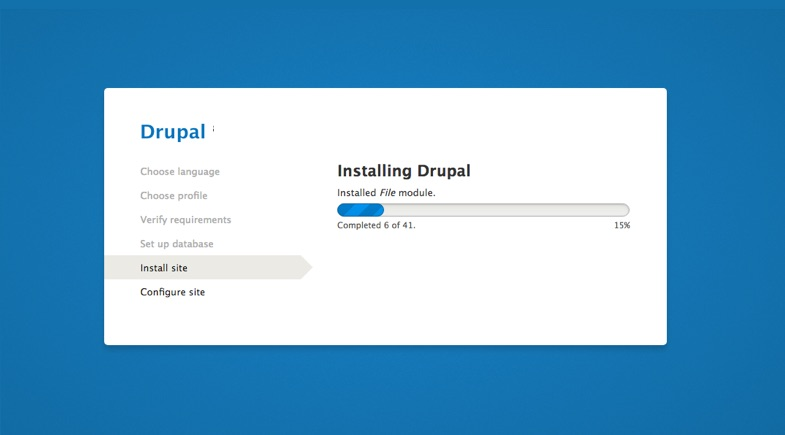
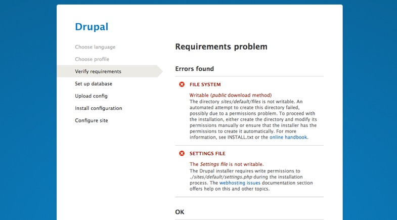

**Step 1**: Copy the entire content from the “em_drupal” directory to the location of your web server where you want your site to be accessed. Make sure that you have copied all files, including the hidden files like .htaccess, etc.

**Step 2**: When all is in place, run the Drupal installer. If your files are located in the root of your web location point your browser to http://yourdoamin/. Also, you can place the Drupal in the sub-directory and point your browser to the sub-directory to run the installation, eg. http://yourdoamin/sub-directory.

**Step 3**: Leave the language to English. If you plan to run your site on other language, you will do that after importing the demo..

**Step 4**: Choose **Standard** installation profile and click on “**Save and Continue**”.

 **Step 5**: Wait for Drupal to be installed.
 
 

 
###  Troubleshooting installation

If you see this message below during installation process, you have to manually create **settings.php** file and give write permissions to the **files** directory.

To manually create **setting.php** file, copy the **sites/default/default.settings.php** to **sites/default/settings.php** and make it writable. 
If you are on Mac or Linux, use your terminal to run this few command from your Drupal root directory:

Create settings.php file: 
`cp sites/default/default.settings.php sites/default/settings.php`

Make settings.php writable: 
`chmod 777 sites/default/settings.php`

Make files directory writable: 
`chmod -R 777 sites/default/files/`

!!! Find more details about server requirements, additional tools and preparing for Drupal installation at [https://www.drupal.org/docs/8/install](https://www.drupal.org/docs/8/install)

