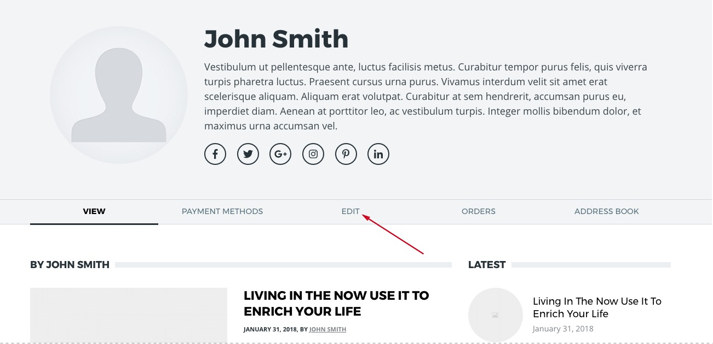
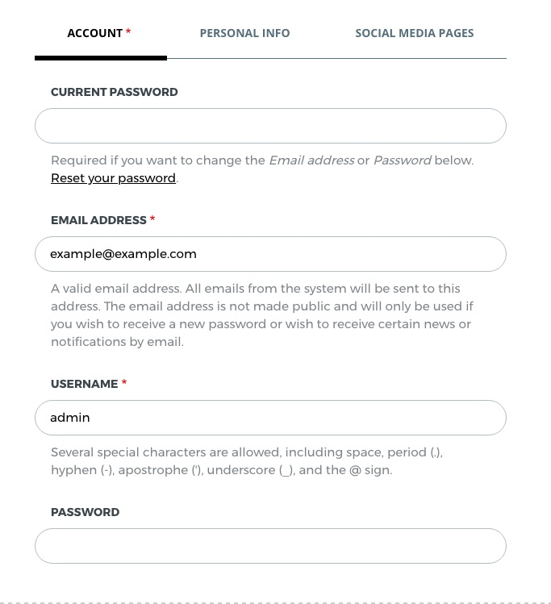
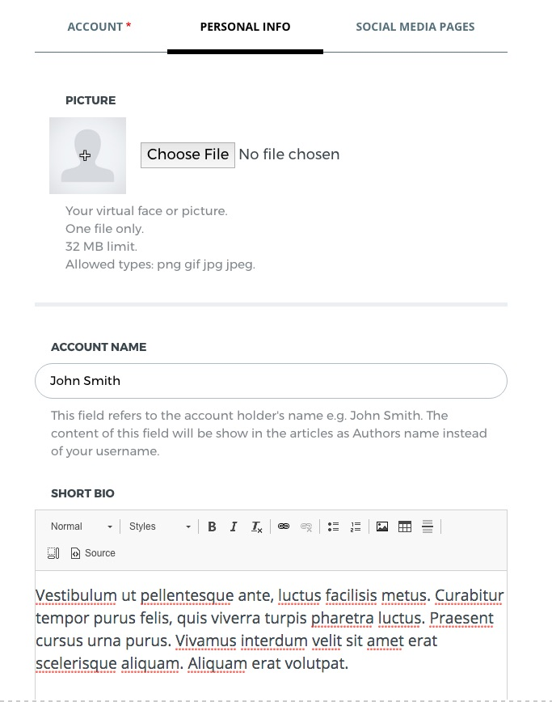
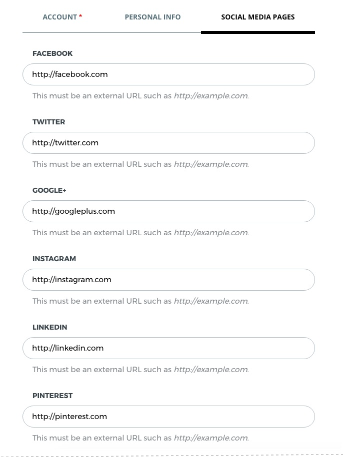

**After the import, your account and access informations were overridden by the Demo.** It is recommended to update your account informations and secure your web location before you move forward with other adjustments.

Go to your account page and click "**Edit**" (`/user/1/edit`)

### Account Info

Under **Account** tab, set the **username**, **password** and **email address**.
!!! Just to remind that your current Drupal password is **demo**.

### Personal Info

Click on the **Personal Info** tab to upload image for your profile, choose account name and write a short bio for your self. This informations will be shown on your profile a.k.a. author's page and also will be used as a signature for your posts.

### Social Media Pages

Click on the **Social Media Pages** tab and add you're social media profiles that you wish to appear on your profile page.

