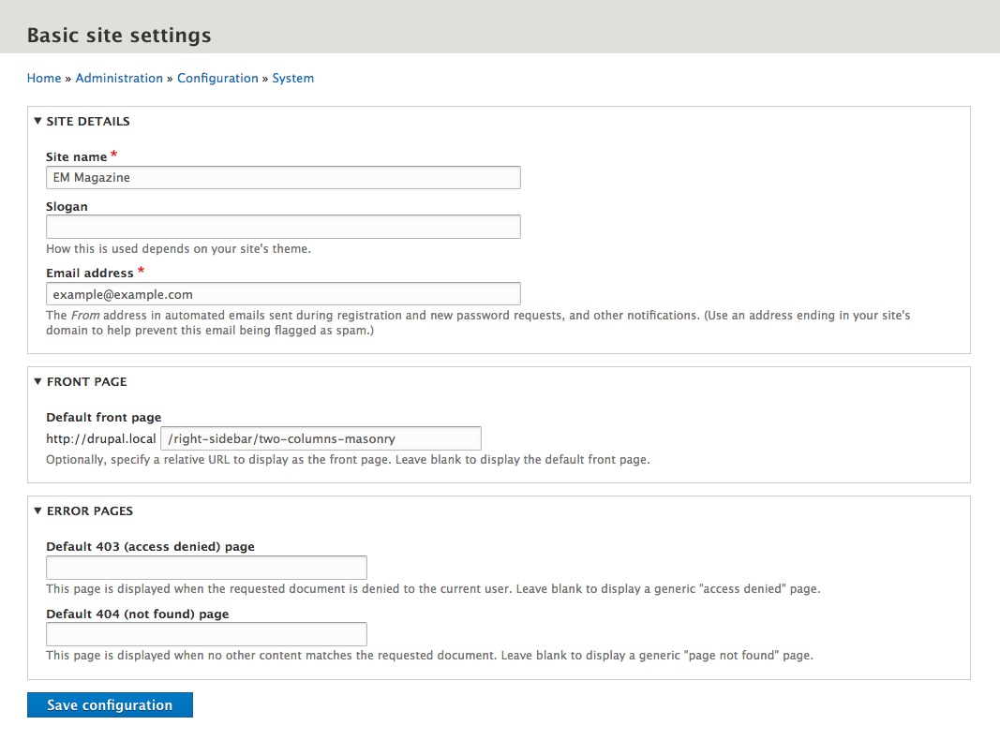
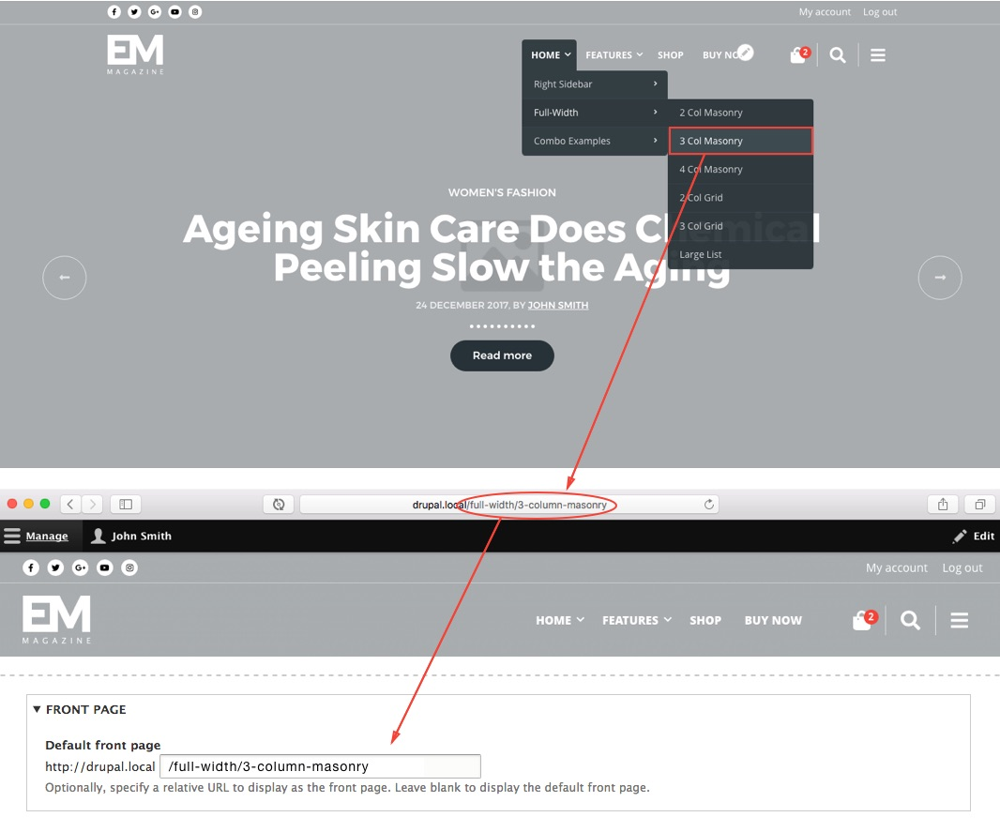

Choose **Configuration > System > Basic site settings** from the **Toolbar** (`/admin/config/system/site-information`)

### Site Details

**Step 1**: Enter the name of your site in the **Site name** field.

**Step 2**: Enter the email address for your site. This email address is used for automated emails sent during registration and new password requests.

!!! You can leave the Slogan field empty. The content of that field is not used in the theme.

### Front page

To set the front page, simply copy the relative path from the URL and place it in the "**Default front page**" field. The Demo contains dozens of predefined homepage concepts. You can use one of them for your home page. Also, you can modified any of these pages later and adjust it for your needs, or you can create your own unique home page.

See the image below for example. Set the "**Three column masonry**" page as a front page.

