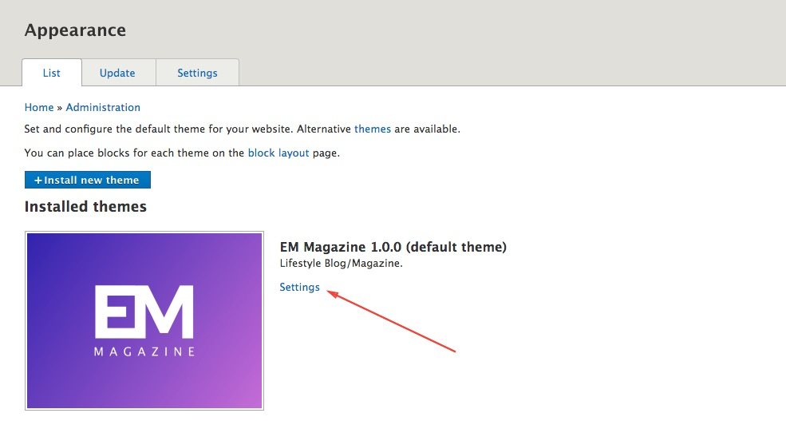
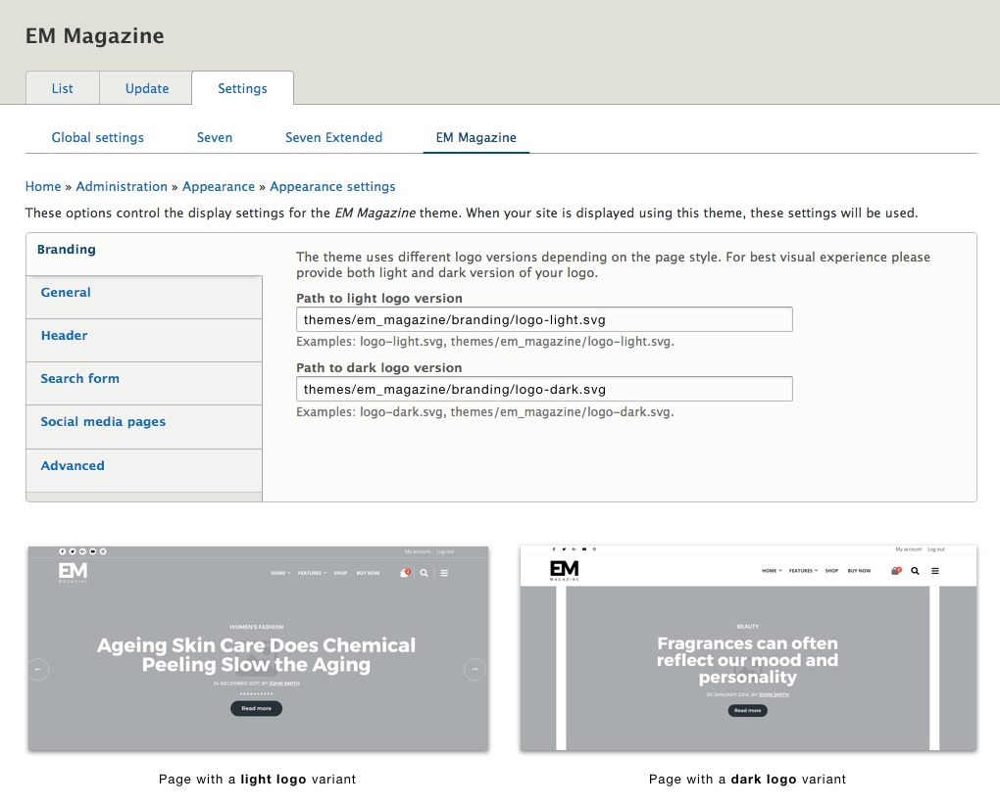
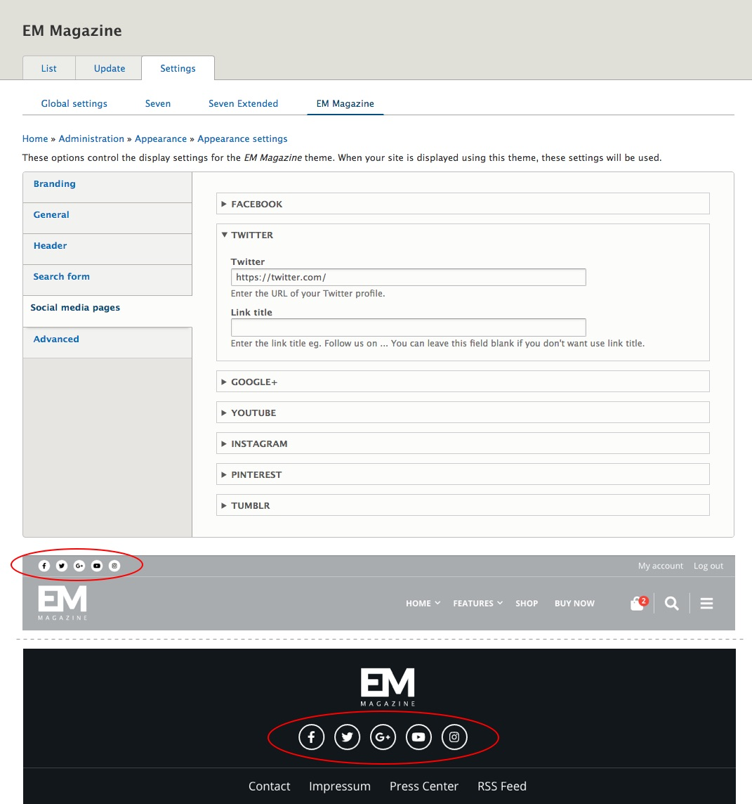

By adjusting theme setting, you can control many theme functionalities. You can experiment a while and adjust them by your needs.

**Step 1**: Click on the **Appearance**  in the Admin Toolbar.

**Step 2**: Click on the theme **Settings** link.

### Branding

The theme uses light and dark logo style. To change the logo, enter a path to your logo in the appropriate field. However, the simplest way is to replace the **logo-light.svg** and **logo-dark.svg** in the `themes/custom/em_magazine/branding`.

### Social Media Pages

Click on the "**Social Media Pages**" tab on the left and add your brand's or product's social media pages to your site. The Social Media links on your site will be available at the top of the header and in the footer.

