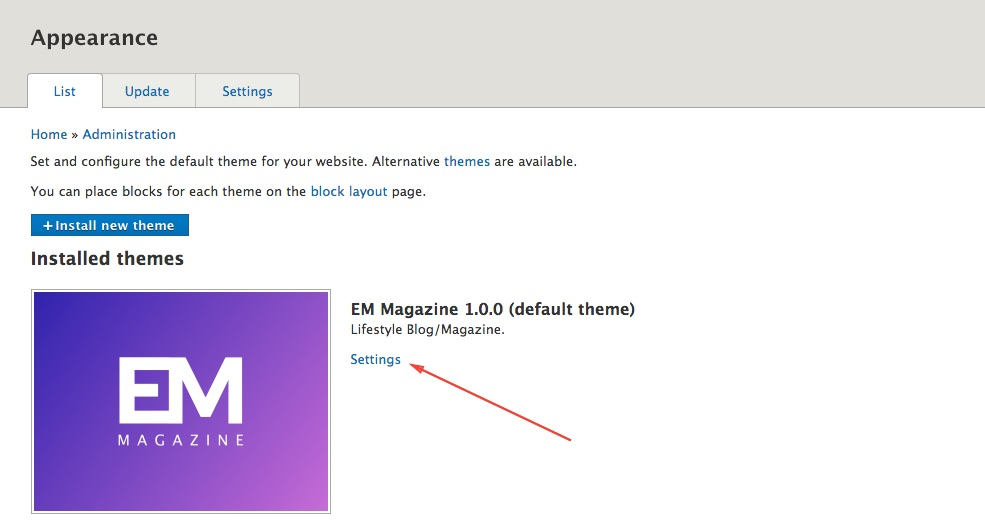
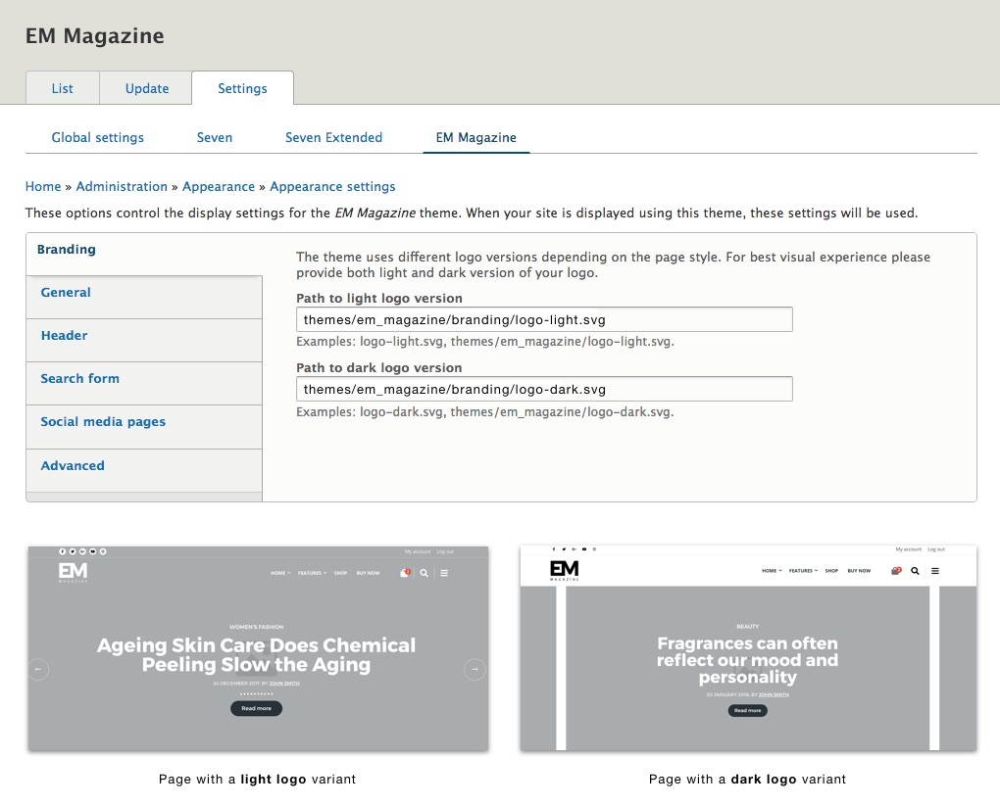
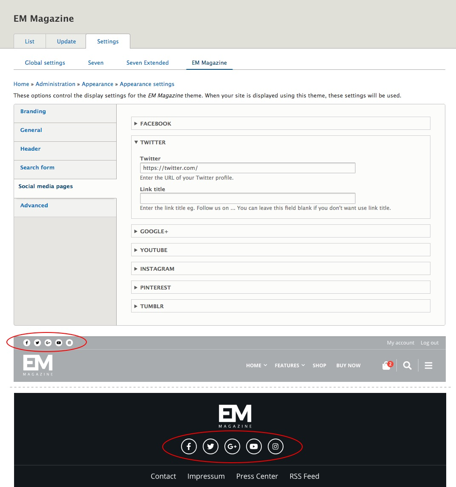

By adjusting theme setting, you can control many theme functionalities. You can experiment a while and adjust them by your needs.

**Step 1**: Click on the **Appearance**  in the Admin Toolbar.

**Step 2**: Click on the theme **Settings** link.

### Branding

The path required by the logo filed is relative to your Drupal root directory. The best location to place your logo is somewhere in your **current default theme** directory.

For example, you can replace the **logo-light.svg** and **logo-dark.svg** in the **branding** directory of the **em_magazine** theme, or you can create new structure, place your logo files and update the path to your logo in the theme settings.

### Social Media Pages

Click on the "**Social Media Pages**" tab on the left and add your brand's or product's social media pages to your site. The Social Media links on your site will be available at the top of the header and in the footer.

