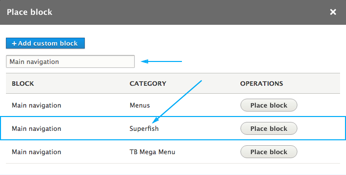
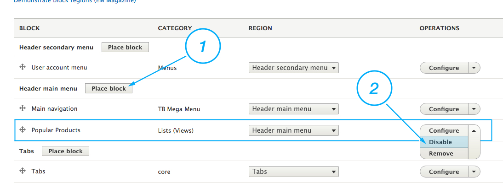
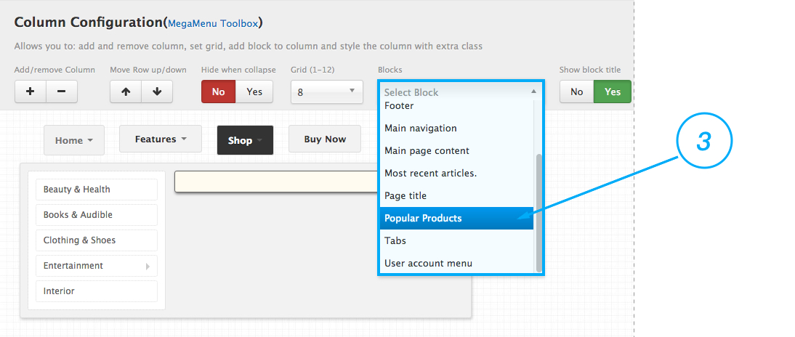
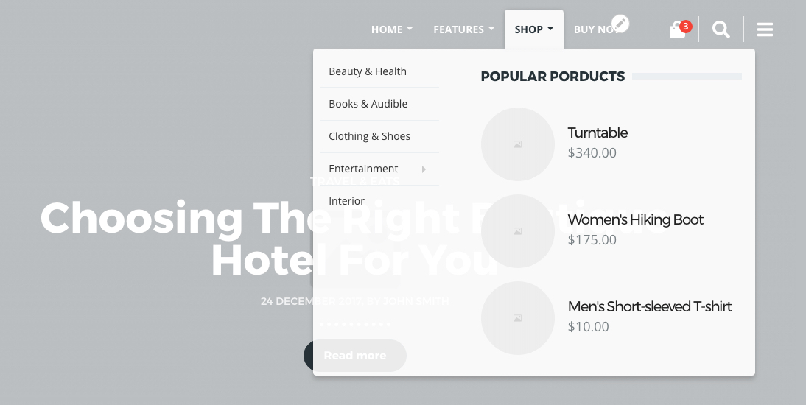

#### Theme implements two menu modules

1. **Superfish** - Which creates drop-down menus with your Drupal menus.
2. **TB Mega Menu** - Gives you an ability to create a Mega Menu on your site.

#### Add Superfish menu

1. Go to the "**Block layout**" page (under Structure) and use the "**Place block**" buttons under "Header main menu" region to create a Superfish block. 
2. Search for your menu using 'menu' as the search term and make sure to select the one with the "**Superfish**" category.

#### Add TB Mega Menu

1. Go to the "**TB Mega Menu**" page (under Structure) to create or edit a TB Mega Menu configuration. Note that the blocks are only created for the MegaMenu configurations that have been created.
2. Go to the "**Block layout**" page and use the "**Place block**" buttons under "Header main menu" region to create a TB Mega Menu block.
3. Search for your menu using 'menu' as the search term and make sure to select the one with the "**TB Mega Menu**" category.

! To make a block visible in the TB Mega Menu "**Blocks**" dropdown list, first you have to place it in any of the theme's regions. You can also disable it if you wont like to be visible in that region

#### Example:

We have a view that shows three most popular products in the Store, so we want to place that block in the Mega Menu under the Shop menu item.

1. We have to place the "Popular products" block in some of the theme regions. For example, we'll place the block in the "Header main menu" region.
2. We will disable the block so the block wont be visible in that region on the site.
3. Now the "Popular products" block is visible under the TB Mega Menu configuration, and we can use it in our menu.

This video below, will help you to better understand TB Mega Menu, its functionalities and way to build your own Mega Menu. 

**Note that the video is referring to Drupal 7 module** which is different then Drupal 8. However, the toolbox area, the TB Mega Menu simulator and the way that the menu is build are almost identical in both modules.

[plugin:youtube](https://www.youtube.com/embed/WnuhbFwsJ3M)
