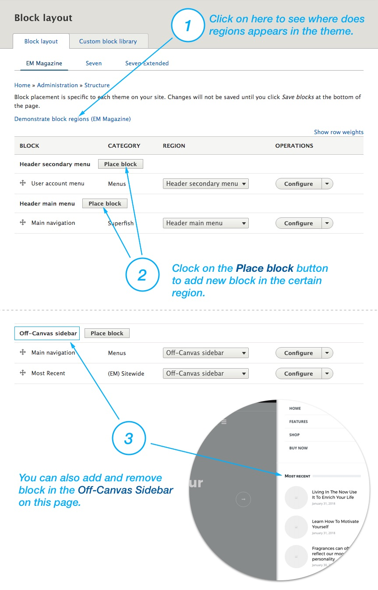

To add or remove content in the Header and the Footer, chose **Structure > Block Layouts** (`/admin/structure/block`).

You can click on the "**Demonstrate block regions**" to see where does regions appears in the theme.

1. Click on the "**Place block**" button on the region where you wish to add a new block.
2. Use "**Configure**" button to configure an existing block. 
3. To disable or remove a block, click on the "**arrow down icon**" on the right side on **Configure** button, and choose your option. 

