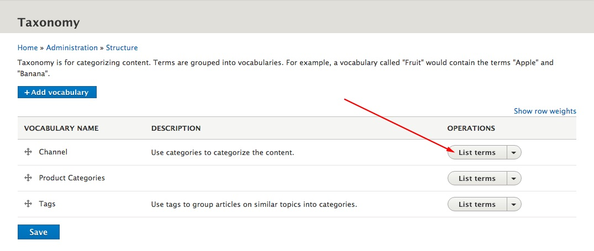
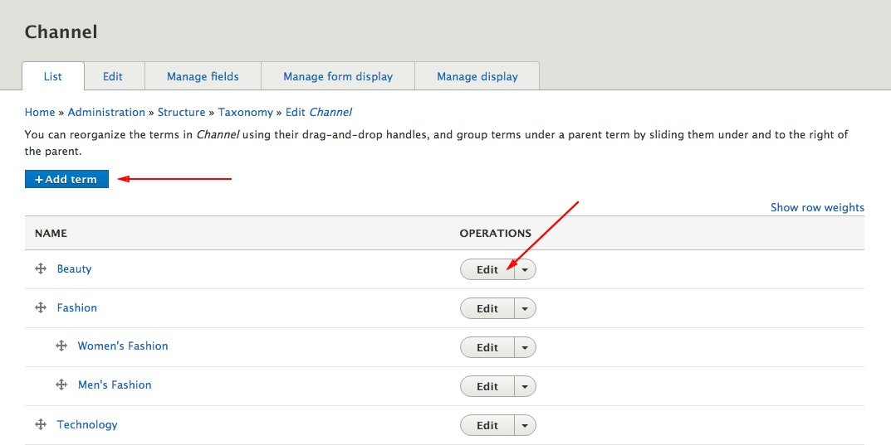

The Channels (Categories) and the Tags are used to group and organize your content.

To manage the cannels and tags:

**Step 1**:  Choose **Structure > Taxonomy** from the toolbar. (`/admin/structure/taxonomy`)

**Step 2**:  Click on the "**List Items**" button on the vocabulary that you wish to add or edit terms.

**Step 3**: Click on the "**Add term**" button to add a new category, or click on "**Edit**" button to category you wish to change.

