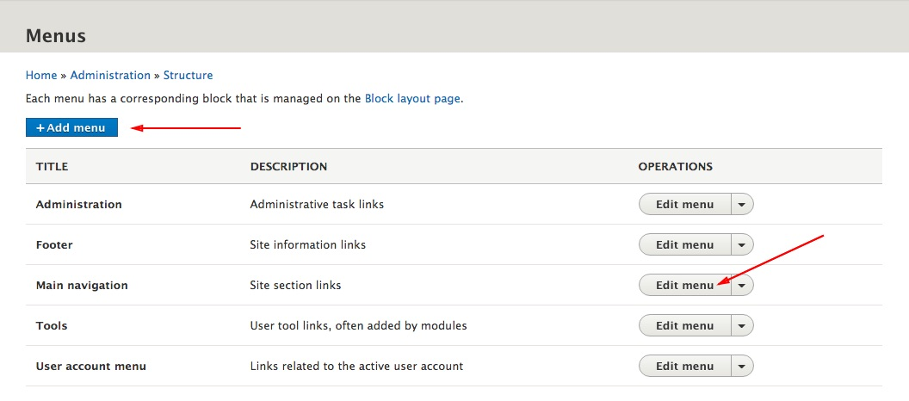
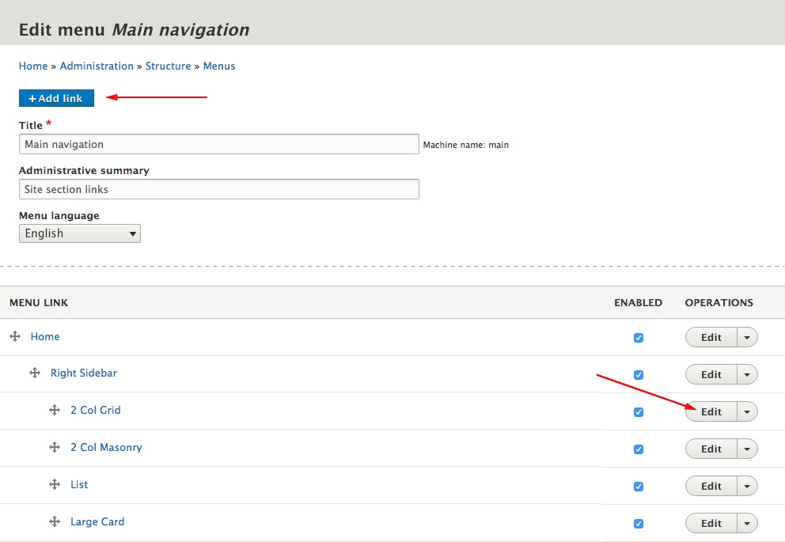

Theme uses three menus which are provided by Drupal:

1. Main navigation - As a primary navigation and contains site section links
2. User account menu - For links related to the active user account
3. Footer - For site information links  

To manage menus and menu items choose **Structure > Menus** form the toolbar. (`/admin/structure/menu`)
You can add a new menu using  "**Add menu**" button, or you can modify an existing menu by clicking on the "**Edit menu**"  button.

---

#### Modifying the Main Menu

**Step 1**: Click on "**Edit menu**" button to edit Main navigations menu 

**Step 2**: Click on the "**Add link**" button to add a new link, or click on the "**Edit**" button on the link you wish to change.

! Always enable "**Show as expanded**" option on a parent menu items, otherwise your parent links wont expand in the off-canvas navigation.

