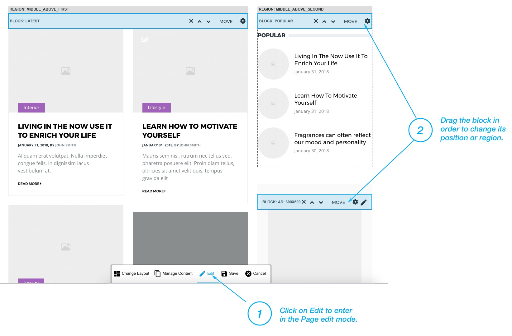
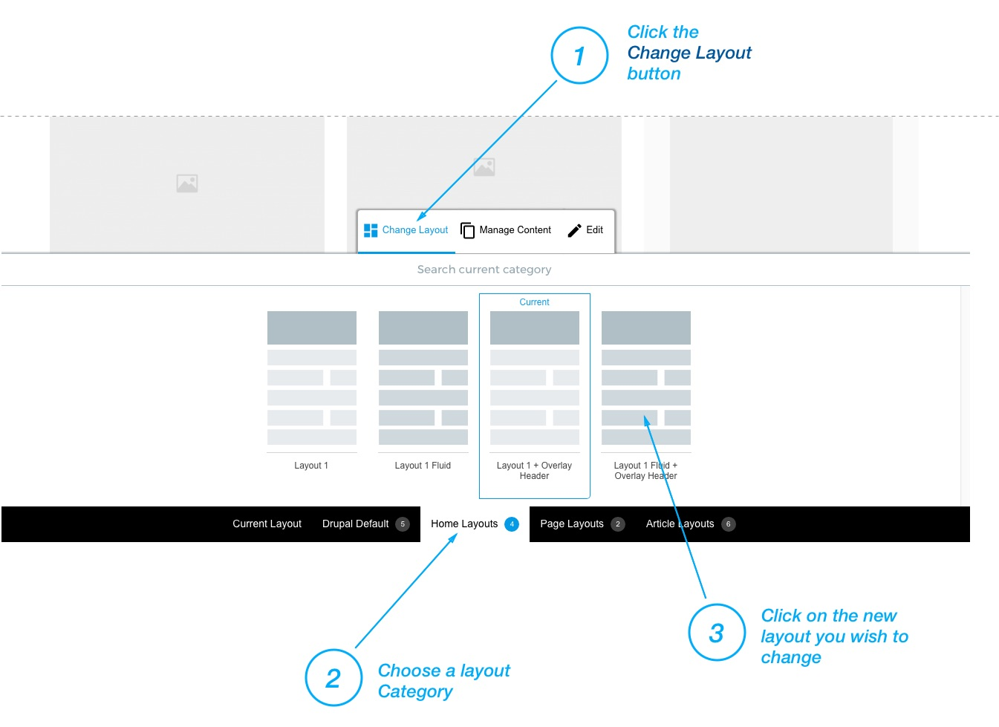

### Modifying page layout

1. Click on the "**Edit**" button at the bottom of the page. This will put the page in edit mode and you will be able to change it's layout.
2. Simply click the block and drag it across the layout to to change it's region or position.

### Add new block

1. Click on the "**Manage Content**" button at the bottom of the page.
2. Click the **Category tab** from which you wish to add content on the page or use search if you're know block's name.
3. Click on the **Card (Content)** you wish to add.
4. Adjust the content's setting by your need and choose region in which you wish to appear. 
5. Click on the "**Add**" button and click "**Save**"

!!! To simplify navigation, the blocks and widgets made for the theme are organized in the categories by page context.  For example, content which is suitable for **Author's Page** lives in the **Author's page category**, or content suitable for **article page** lives in **Article Pages category**.

### Changing the Page Layou

1. Click the **Change Layout** button at the bottom of the page.
2. Choose a layout category
3. Click on the new layout you wish to change

