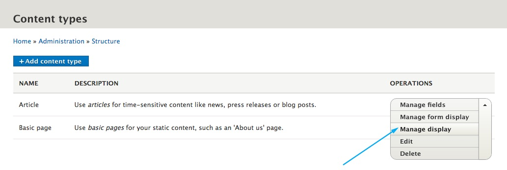
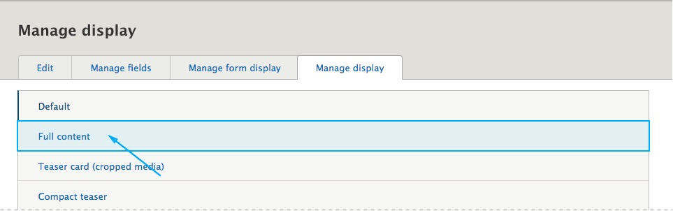
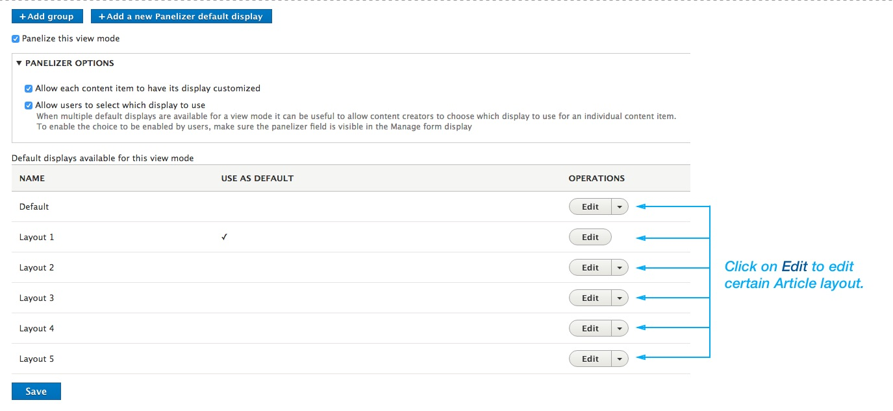
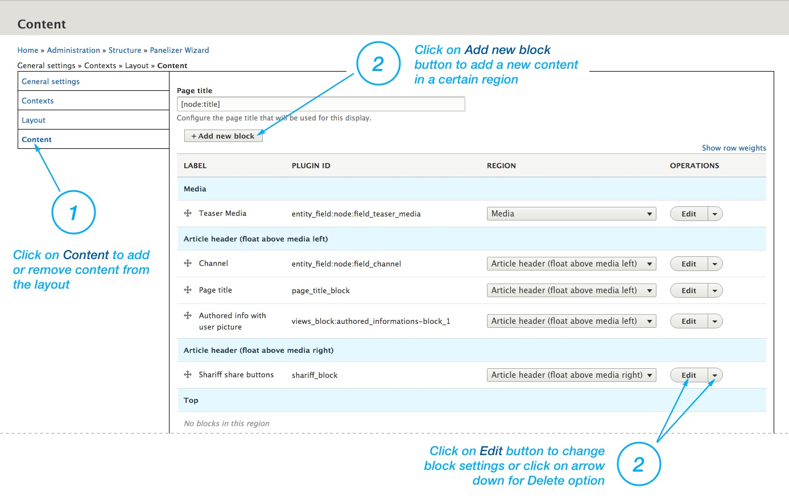

Managing the article layouts is almost the same as [managing page layout](/pages/managing-page-layouts). The only difference is that the changes you've made with the **IPE** (In-Place Editor) will only be applied to that article, instead on all articles that shares the same layout.

So if you want to make layout changes to a certain article, you can follow [managing page layout](/pages/managing-page-layouts) procedure. Otherwise, to make layout changes which will be appled to all articles that shares the same layout, do the following:

**Step 1**: Choose **Structure > Content Types** form the toolbar. (`/admin/structure/types`)

**Step 2**: Choose "**Manage display**" from operations dropdown menu. (`/admin/structure/types/manage/article/display`)

**Step 3**: Click the **Full content** tab. (`/admin/structure/types/manage/article/display/full`)

**Step 4**: Click on the **Edit** button on the layout you wish to edit.

**Step 5**: Adjust the layout by your needs.

