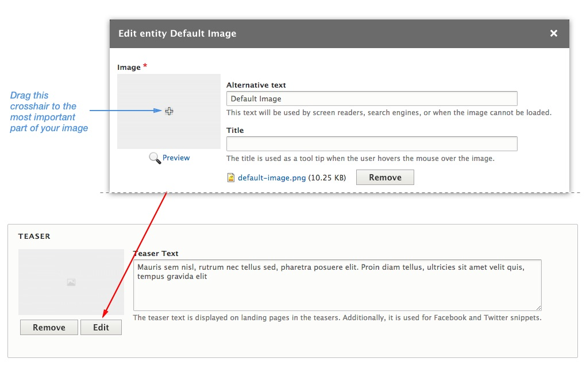

To create a new **Article**, from the toolbar choose **Content > Add content > Article**.  (`/node/add/article`)

---

#### Base Article Info

1. From the "**Full Content**" option menu choose layout for the article. You can choose from six different layouts for each of your articles. Check the layouts in action on the demo site:
[Layout 1 (Default)](http://em.pinkdexo.com/fragrances-can-often-reflect-our-mood-and-personality), 
[Layout 2](http://em.pinkdexo.com/13-best-new-menswear-items-buy-week), 
[Layout 3](http://em.pinkdexo.com/attraction-always-matches-vibrations-current-moment),
[ Layout 4](http://em.pinkdexo.com/idea-god-not-henceforth-relevant), 
[Layout 5](http://em.pinkdexo.com/using-overstock-sites-net-cookware-purchases), 
[Layout 6](http://em.pinkdexo.com/mind-power-ultimate-success-formula)

2. **Channel** represent the site hierarchy. You can organize your content in categories and sub-categories (e.g. Lifestyle, Tech, Sports, etc). See [Categories and Tags](/managing-content/channels-and-tags) section for more on this topic.

3. In the **Title field** enter a title for your article.

4. **Tags** are used to group a content on similar topics. You can enter multiple tags in the field separated with (,) comma. 

---

### Article Teaser

In the teaser section add **Teaser Image** and **Teaser Text**. The theme utilizes Drupal core **Media** module, which allows you to browse and reuse existing media that has been uploaded to your site.

Click on  the "**Select Image**" button and upload image, or click on the "**Select existing**" tab to use an existing image.

After choosing image for your teaser, you can click on the "**Edit**" button and use **Focal Point** to specify the portion of an image that is most important. For example, this will prevent  thumbnail that cuts off the subject's head. 

You will notice a **crosshair** in the middle of the image. Drag this crosshair to the most important part of your image. Alternatively you can click on the important part of your image if dragging seems too daunting.

---

#### Article Body

In this theme, the classic Body field is replaced with a **Paragraph Builder** as a new way of content creation. This will make things cleaner and will give you more editing power and flexibility. Instead of putting all the content in one WYSIWYG body field including images and videos, you can now choose on-the-fly between pre-defined Paragraph Types independent from one another.

To add new paragraph click on the "**Add paragraph**" button and from the pop-up choose which type of paragraph you wish to add.

---

#### Publishing Options

Use Publishing Options to promote your article on the front page, added it to the Featured Slider or in the Editor's Picks block, or mark his teaser as featured or highlighted.

