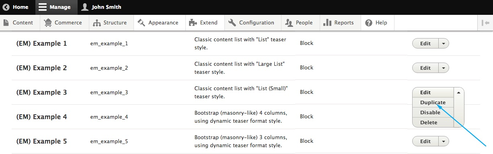
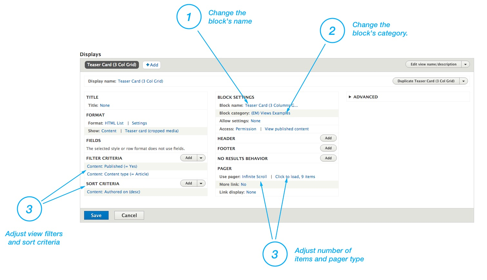

**Step 1**: Choose **Structure > Views** from toolbar. (`/admin/structure/views`)

**Step 2**: Choose "**Duplicate**" from the dropdown menu on the view you wish to make a copy from.

**Step 3**: Give the new view name and unique machine name.

**Step 4**: Adjust he view by your needs.

1. Change the block's **name**.
2. Change the **category**. This is the place where you can find the block later when you'll add it on the page. See "[Add new block](/pages/managing-page-layouts)" section.
3. Adjust view **filters** and **sort** criteria
4. Adjust **number of items** and **pager** type

