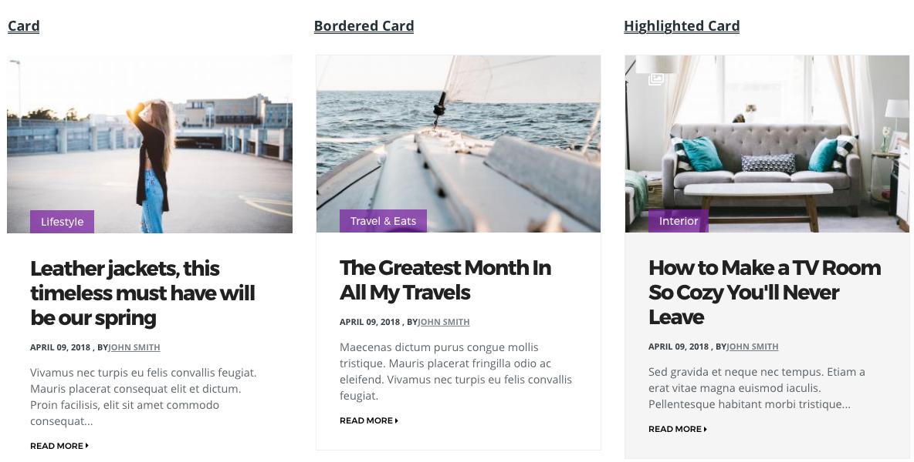
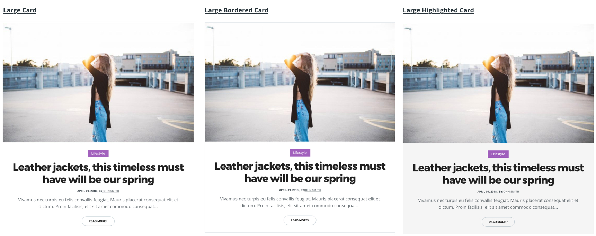

## Teaser Card



```html
<div class="teaser teaser--card">
  <div class="teaser__media">
    <div class="relative">
      <div class="channel channel--boxed teaser__channel">
        Category
      </div>
      <div class="image teaser__image">
        <a href="#">
          
        </a>
      </div>
    </div>
  </div>
  <div class="teaser__content">
    <h2 class="teaser__headline">
      <a href="#">Title</a>
    </h2>
    <div class="teaser__authored">
      July 5, 2018, by Author
    </div>
    <div class="teaser__body">
      Lorem ipsum dolor sit amet, consectetur adipiscing elit...
    </div>
    <div class="teaser__link">
      <a href="#">Read more</a>
    </div>
  </div>
</div>
```

## Large Teaser Card



```html
<div class="teaser teaser--card--large">
  <div class="teaser__media">
    <div class="image teaser__image">
      <a href="#">
        
      </a>
    </div>
  </div>
  <div class="teaser__content text-md-center">
    <div class="channel channel--boxed teaser__channel">
      Category
    </div>
    <h2 class="teaser__headline">
      <a href="#">Title</a>
    </h2>
    <div class="teaser__authored">
      July 5, 2018, by Author
    </div>
    <div class="teaser__body">
      Lorem ipsum dolor sit amet, consectetur adipiscing elit...
    </div>
    <div class="button teaser__link">
      <a href="#">Read more</a>
    </div>
  </div>
</div>
```

## Small Teaser Card


```html
<div class="teaser teaser--card--small">
<div class="teaser__media">
    <div class="relative">
      <div class="channel channel--boxed teaser__channel">
        Category
      </div>
      <div class="image teaser__image">
        <a href="#">
          
        </a>
      </div>
    </div>
  </div>
  <div class="teaser__content text-md-center">
    <h2 class="teaser__headline">
      <a href="#">Title</a>
    </h2>
    <div class="teaser__authored">
      July 5, 2018, by Author
    </div>
  </div>
</div>
```

## Element Class

| Class Name | Description |
| ---------- | ----------- |
teaser--card | Defines teaser card
teaser--card--large | Defines large teaser card
teaser--small--large | Defines small teaser card


## Modifier Class

| Class Name | Description |
| ---------- | ----------- |
teaser--bordered | Creates border around the teaser card
is--highlighted | Highlights the teaser card

