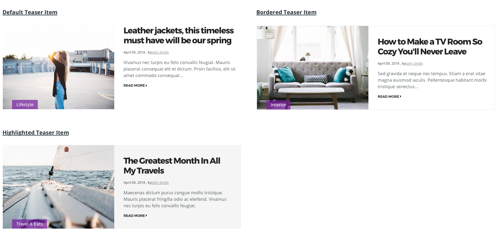

## Default Teaser Item




```html
<div class="teaser teaser--item">
  <div class="teaser__media">
    <div class="relative">
      <div class="channel channel--boxed teaser__channel">
        Category
      </div>
      <div class="image teaser__image">
        <a href="#">
          
        </a>
      </div>
    </div>
  </div>
  <div class="teaser__content">
    <h2 class="teaser__headline">
      <a href="#">Title</a>
    </h2>
    <div class="teaser__authored">
      July 5, 2018, by Author
    </div>
    <div class="teaser__body">
      Lorem ipsum dolor sit amet, consectetur adipiscing elit...
    </div>
    <div class="teaser__link">
      <a href="#">Read more</a>
    </div>
  </div>
</div>
```

---

## Large Teaser Item


```html
<div class="teaser teaser--item">
  <div class="teaser__media">
    <div class="image teaser__image">
      <a href="#">
        
      </a>
    </div>
  </div>
  <div class="teaser__content">
    <div class="channel channel--bordered teaser__channel">
      Category
    </div>
    <h2 class="teaser__headline">
      <a href="#">Title</a>
    </h2>
    <div class="teaser__authored">
      July 5, 2018, by Author
    </div>
    <div class="teaser__body">
      Lorem ipsum dolor sit amet, consectetur adipiscing elit...
    </div>
    <div class="button teaser__link">
      <a href="#">Read more</a>
    </div>
  </div>
</div>
```
---

## Small Teaser Item


```html
<div class="teaser teaser--item">
  <div class="teaser__media">    
    <div class="image image--circular teaser__image">
      <a href="#">
        
      </a>
    </div>
  </div>
  <div class="teaser__content">
    <h2 class="teaser__headline">
      <a href="#">Title</a>
    </h2>
    <div class="teaser__authored">
      July 5, 2018, by Author
    </div>
  </div>
</div>
```
---

### Element Class

| Class Name | Description |
| ---------- | ----------- |
teaser--item | Defines teaser item
teaser--item--large | Defines large teaser item
teaser--small--large | Defines small teaser item


### Modifier Class

| Class Name | Description |
| ---------- | ----------- |
teaser--bordered | Creates border around the teaser item
is--highlighted | Highlights the teaser item