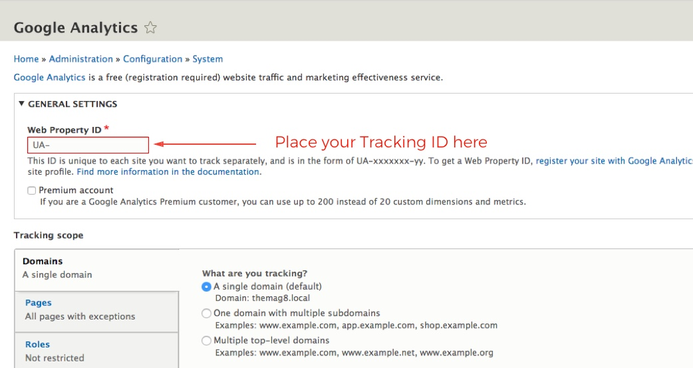

**Step 1**: Go to **Extend** and enable the **Google Analytics** module if its not enabled yet. (`/admin/modules`)

**Step 2**: Go to **Configuration > System > Google Analytics** (`/admin/config/system/google-analytics`).

**Step 3**: Place the Google Analytics **Traction ID** in the "Web Property ID" field.

**Step 4**: Click on **Save Configuration**

### Don't have Google Analytics account?

1. Go to [http://google.com/analytics](http://google.com/analytics)
2. Note: If you have a Google account, and are not signed in, click Sign in. If you do not have a Google account, click Create an account.
3. Once you have signed in to your Google account, click Access Google Analytics.
4. Click **Sign up**.
5. Fill in your Account Name, Website Name, Website URL, select an Industry Category and Reporting Time Zone.
6. Click Get **Tracking ID**.