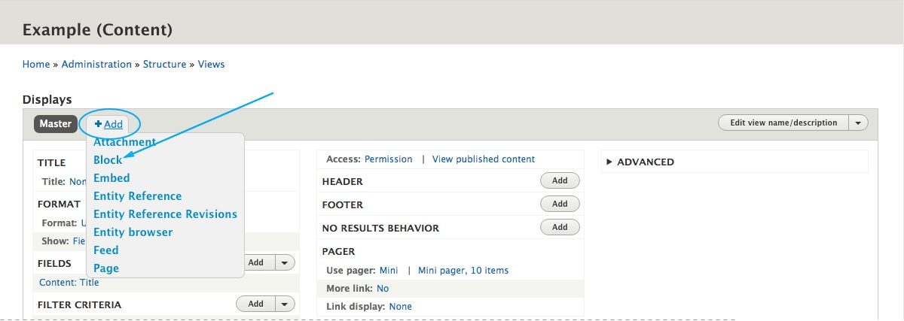
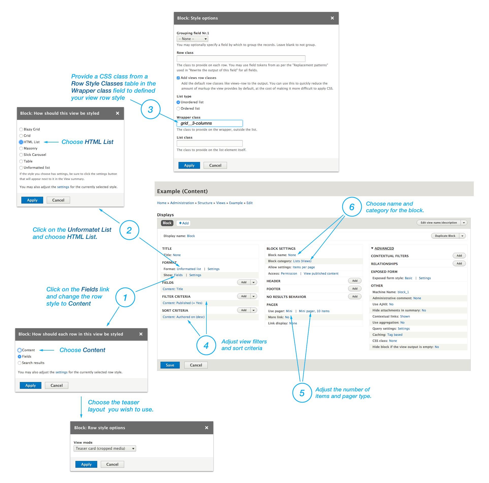

1. Under Administration toolbar choose **Structure > Views**. (`/admin/structure/views`)
2. Click the "**Add new view**" button.

3. Give the view a name and click the **Save and edit** button at bottom of the page.
4. Click on the **Add** dropdown menu and choose **Block**.

5.  Setting up the View

     1. Click on the **Fields** link, change the row style to **Content** and choose a **teaser layout** form the list. See [available teaser layouts.](/views-and-teasers/available-teaser-layouts)
     2. Click on the **Unformatet List** and change it to **HTML List**.
     3. Enter a CSS class from a [**Row Style Classes** ](#row-style-classes) in the **Wrapper class** field to defined the view row style.
     4. Adjust the view **filters and sort criterias**.
     5. Adjust the **number of items and choose a pager type**.
     6. Choose name and category for the block.

---

### Row style classes

##### Grid

| Class Name | Description |
| -------------- | ------------- |
| **grid--2-columns** | Creates two columns grid. |
| **grid--3-columns** | Creates three columns grid. |
| **grid--4-columns** | Creates four columns grid. |
| **grid--5-columns** | Creates five columns grid. |
| **grid--6-columns** | Creates six columns grid. |

 
##### Bootstrap Card Columns

| Class Name | Description |
| -------------- | ------------- |
| **column--2-columns** | Creates two columns masonry like list. See [Bootstrap Card columns](https://getbootstrap.com/docs/4.0/components/card/#card-columns). |
| **column--3-columns** | Creates three columns masonry like list. See [Bootstrap Card columns](https://getbootstrap.com/docs/4.0/components/card/#card-columns). |
| **column--4-columns** | Creates four columns masonry like list. See [Bootstrap Card columns](https://getbootstrap.com/docs/4.0/components/card/#card-columns). |

 
##### Masonry

| Class Name | Description |
| -------------- | ------------- |
| **masonry--2-columns** | Crete two columns masonry list. Applicable field: CSS class |
| **masonry--3-columns** | Crete three columns masonry list. Applicable field: CSS class |
| **masonry--4-columns** | Crete four columns masonry list. Applicable field: CSS class |

 
##### List

| Class Name | Description |
| -------------- | ------------- |
| **list** | Creates a list of items. |

 
#### Responsive variations 

You can also apply **Bootstrap responsive variations** on **grid--N** classes like this: **grid-VARIATION--N-columns**

**Example**: 
grid--3-columns 
grid-sm--3-columns 
grid-md--3-columns 
grid-lg--3-columns 
grid-xl--3-columns 

This means that you can combine row classes in the Wrapper filed to transform the view depending on display width. 
For exaple, if you use this three classes in the Wrapper field `list grid-md--2-columns grid-xl--4-columns`, you will have a list of items on a mobile devices, 2 columns grid on tablets and  4 columns grid on large displays.

---

### Utility Classes

| Class Name | Description |
| ---------- | ----------- |
| **no-borders** | Removers borders from teasers |
| **no-gutters** | Removes the gutter from the list.  You can combine this class with any grid--N class. |
| **equal-height** | Combine this class with grid--N classes to make an equal height on a Teaser Cards in the grid. |
