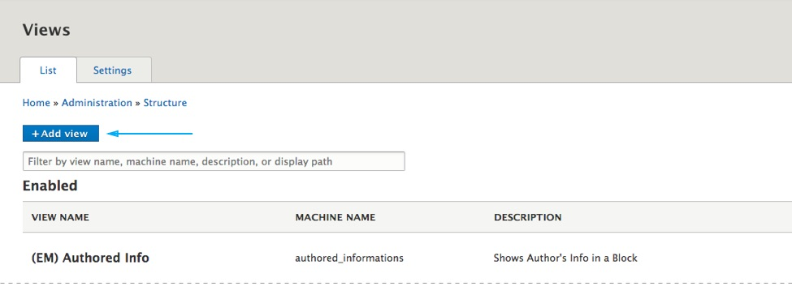

**Step 1**: Go to Views page. **Choose Configure > Views** from toolbar.

**Step 2**: Click on the "**Add new view**" button.

**Step 3**: Give a view name and click on the "**Save and edit**" button at bottom of the page.

**Step 4**: From the "**Add**" dropdown menu choose to add **Block**.

**Step 5**:  Setting up the View

1. Click on the **Fields** link, change the row style to **Content** and choose a **teaser layout** form the list. See [available teaser layouts.](/views-and-teasers/available-teaser-layouts)
2. Click on the **Unformatet List** and choose **HTML List**.
3. Provide a CSS class from a [**Row Style Classes table** ](#row-style-classes) in the **Wrapper class** field to defined your view row style.
4. Adjust view **filters and sort criteria**.
5. Adjust the number of items and pager type.
6. Choose name and category for the block.

---

 
### Row Style Classes

| Class Name | Description |
| ---------- | ----------- |
| **grid__2-columns** | Creates two columns grid. Applicable field: Wrapper class  |
| **grid__3-columns** | Creates three columns grid. Applicable field: Wrapper class |
| **grid__4-columns** | Creates four columns grid. Applicable field: Wrapper class |
| **grid__5-columns** | Creates five columns grid. Applicable field: Wrapper class |
| **grid__6-columns** | Creates six columns grid. Applicable field: Wrapper class |
| **column__2-columns** | Creates two columns masonry like list. See [Bootstrap Card columns](https://getbootstrap.com/docs/4.0/components/card/#card-columns). Applicable field: Wrapper class |
| **column__3-columns** | Creates three columns masonry like list. See [Bootstrap Card columns](https://getbootstrap.com/docs/4.0/components/card/#card-columns). Applicable field: Wrapper class  |
| **column__4-columns** | Creates four columns masonry like list. See [Bootstrap Card columns](https://getbootstrap.com/docs/4.0/components/card/#card-columns). Applicable field: Wrapper class  |
| **masonry__2-columns** | Crete two columns masonry list. Applicable field: CSS class |
| **masonry__3-columns** | Crete three columns masonry list. Applicable field: CSS class |
| **masonry__4-columns** | Crete four columns masonry list. Applicable field: CSS class |
| **list** | Creates classical list. Applicable field: Wrapper class |

 

### Teaser Style Classes

| Class Name | Description |
| ---------- | ----------- |
| **no-borders** | Removers the border from a teaser element (e.g. teaser card). You can combine this class with any of the Row Style classes (e.g: grid grid__3-columns, no-borders). Applicable field: Wrapper class. |
| **no-gutters** | Removes the gutter from the list. You can combine this class with any Row Style class that creates grid. Applicable field: Wrapper class.|
| **equal-height** | Use this class to achieve an equal height of the Teaser Cards in the grid. You can combine this class with any Row Style class that creates grid. Applicable field: Wrapper class. |