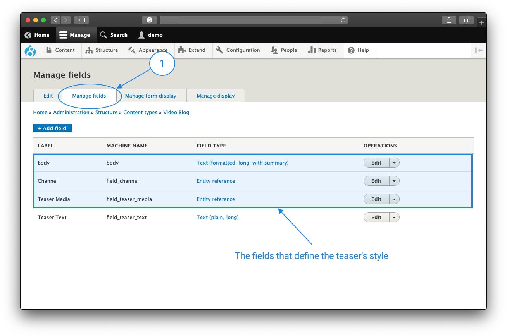
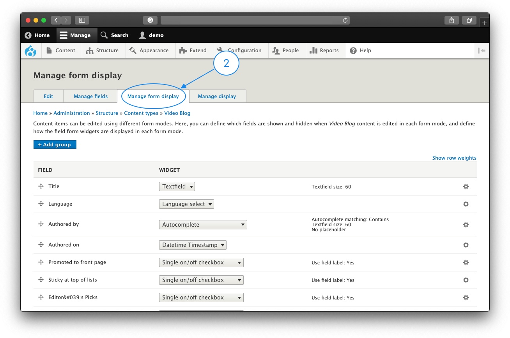
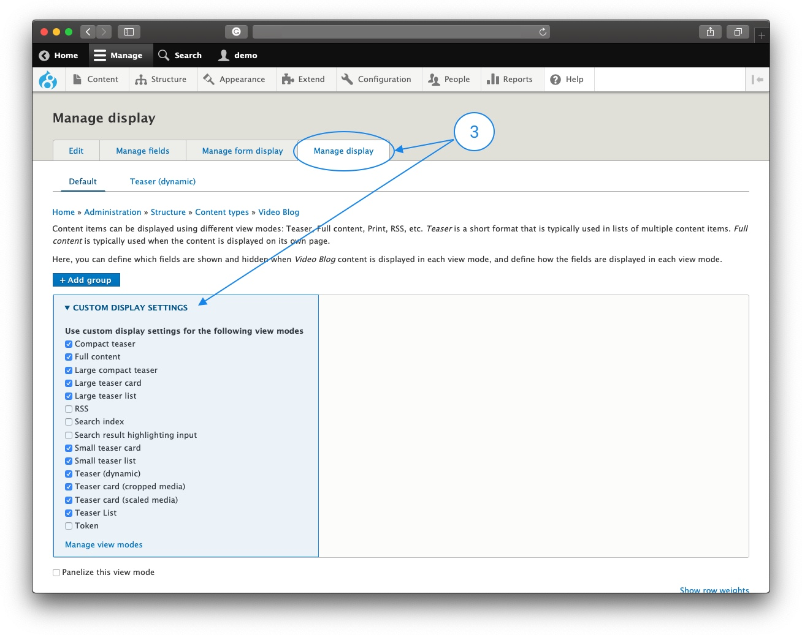

The theme is designed to work with the default Drupal content types, Article (article), and the Basic Page (page).

Let's say that you want to create a new content type **Video Blog (video_blog)** and use the theme layouts on it. To do that, you have to do some Drupal configuration and create a few template files which will inherit everything from the original theme files.

1. Go to the **Manage fields** section of **video_blog** content type and add these fields: **Channel**, **Teaser media**, and **Teaser text**. 
These fields define the teaser's style. Of course, you can add additional fields depends on your needs. Also, If you like to make the full content display similar to the Article content type, you have to add Paragraphs and Panelizer fields.

2. Click the **Manage form display** tabs under the video_blog content type and configure the fields like those in the Article  (`admin/structure/types/manage/article/form-display`). 
This step is not required, but if you like to have a similar content editing experience with an article content type, you should do that. 

3. Click the **Manage display** tab, then click on the **Custom display setting** to expand the options. Enable the display options you like to use on this content type and replicate the configuration for each display from the Article content type.

4. In the sub-theme, duplicate the `themes⁩/⁨custom⁩/⁨em_magazine⁩/⁨content⁩/⁨CUSTOM_CONTENT_TYPE⁩` directory and rename it from **CUSTOM_CONTENT_TYPE**⁩ to your content type. In our case to video_blog.

5. Rename the template files so that the **TYPE** will be your content type's machine name.

6. Clear the Drupal cache, and you are all done.

