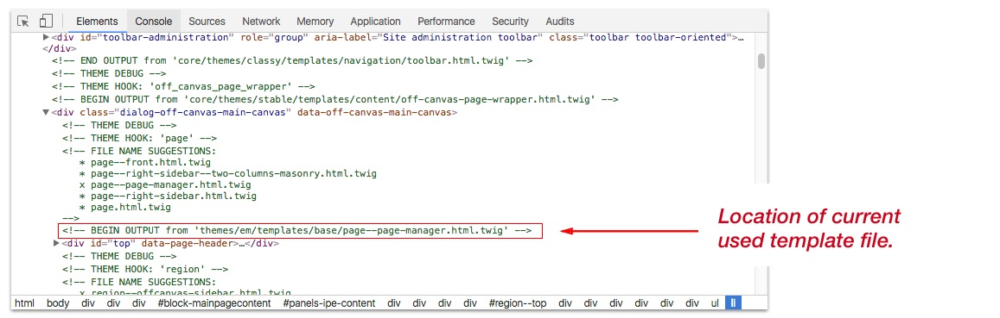

The EM Magazine contains few themes/sub-themes.

1. **Charm** (machine name: `charm`) - Which hold all vendor libraries used by the EM.
3. **EM** (machine name: `em`) - This is the main "base" theme.
3. **EM Magazine** (machine name: `em_magazine`) - This is the EM's sub-theme and actual default theme.
4. **Seven Extended** (machine name: `pd_seven`) - This theme is extend version Drupal Seven theme and comes with improved UI for better content editing experience. 

Charm and EM are hidden themes and you cannot see them on the Appearance page. The Seven Extended theme is visible and is used as Administration theme for EM Magazine.

! If you plan to change some of the template files and styles, or you wish to add a new template file, do not modify **EM (em)** theme files. Instead, use the **EM Magazine (em_magazine)** sub-theme to make all of your changes. On this way, you can continue use all future update of the theme and keep all of your modifications. 

---

#### Modify existing template file

**Step 1**: Copy the template file from the `themes/em/templates` and place it the sub-theme templates directory `themes/em_magazine/templates`.

**Step 2**: Go to performance page **Configuration > Development > Performance** (`/admin/config/development/performance`) and click on "**Clear all cache**" button

**Step 3**: Apply the changes to your new template file 

---

#### How to know which template file is used by the theme

Drupal 8 has own debugging tool that allows you to locate the template file that outputs the markup.

Edit the `sites/default/settings.php` and uncomment this code:

```php
if (file_exists($app_root . '/' . $site_path . '/settings.local.php')) {
  include $app_root . '/' . $site_path . '/settings.local.php';
}
```

You will find the code near the bottom of `settings.php` file.

! Do not leave the code uncommented on a production site. You will face a performance issues.

After you'd save the changes, use the browser's inspector and you will see comments in the code:


