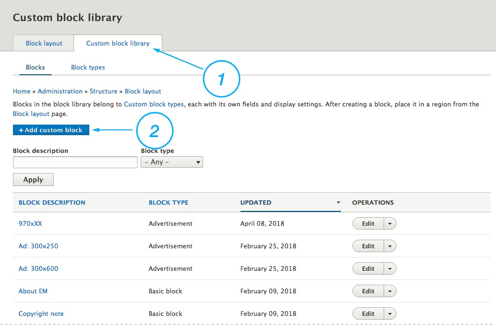

Utilization of Panels module allows you to place your advertisement almost everywhere on your site.

To create an Ad, you should create a custom block of type advertisement.

1. Form the toolbar choose **Structure > Block layout** (`/admin/structure/block`)
2. Click on "**Custom block library**" tab (`/admin/structure/block/block-content`)
3. Click on "**Add custom block**" button and choose **Advertisement**.
5. In the **Block description** field enter your administrative description and in the **Body** enter your Ad (image, video, code, etc.).

Now you can place your Ad on the page. The Ad block will be available at the Custom category in the Manage Content bar. See [Add New Block](/pages/managing-page-layouts#add-new-block-to-the-page) section.

