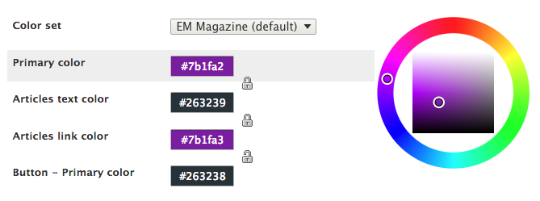
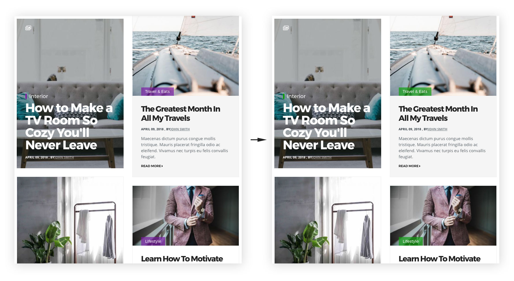

The theme integrates Drupal **Color module**  which allows you to change the color scheme of the theme.

To change the color scheme:

1. Go to Extend and enable the Color module. (`admin/modules`)
2. From the admin toolbar choose **Appearance**, then click the "**Settings**" link under "EM Magazine" theme. (`admin/appearance/settings/em_magazine`)
3. Use the Color Interface to change the color scheme.

---

